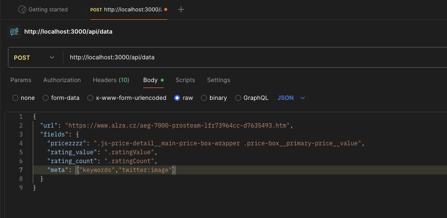
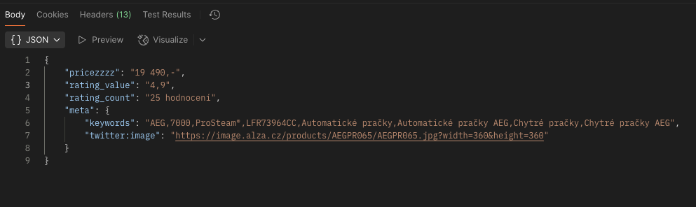

# 🧠 HtmlScraper API

HtmlScraper is a lightweight Ruby on Rails API that fetches and parses HTML content from any URL using custom CSS selectors or meta tags. It's designed for programmatic consumption — ideal for scraping prices, ratings, or metadata directly from ecommerce or content pages.

---

## 🚀 Features

- 🔎 Extract content using CSS selectors or `meta` tag names
- ⚡ Automatic HTML caching (using Rails cache)
- 🌐 HTTP interface via `GET` and `POST` endpoints
- 🔧 Proxy-ready (via ScraperAPI)
- 🔐 Zero database dependency

---

## 🐳 Running with Docker

> This app does **not** use a database, so the setup is ultra-light.

```bash
# Stop any previous containers (if running)
docker compose down

# Remove unused images & volumes
docker system prune --all --force --volumes

# Build and run the app in the background
docker compose up --build -d
```
---
## 📬 API Usage
### `POST /api/data`

Send JSON with a target URL and CSS/meta selectors.
🔸 Request
<pre>
{
  "url": "https://www.alza.cz/aeg-7000-prosteam-lfr73964cc-d7635493.htm",
  "fields": {
    "pricezzzz": ".js-price-detail__main-price-box-wrapper .price-box__primary-price__value",
    "rating_value": ".ratingValue",
    "rating_count": ".ratingCount",
    "meta": ["keywords","twitter:image"]
  }
}
</pre>
🔸 Response
<pre>
{
    "pricezzzz": "19 490,-",
    "rating_value": "4,9",
    "rating_count": "25 hodnocení",
    "meta": {
        "keywords": "AEG,7000,ProSteam®,LFR73964CC,Automatické pračky,Automatické pračky AEG,Chytré pračky,Chytré pračky AEG",
        "twitter:image": "https://image.alza.cz/products/AEGPR065/AEGPR065.jpg?width=360&height=360"
    }
}
</pre>
### `GET /api/data`
You can also send the same payload via query parameters:
<pre>
http://localhost:3000/api/data?url=https%3A%2F%2Fwww.alza.cz%2Faeg-7000-prosteam-lfr73964cc-d7635493.htm&fields[pricezzzz]=.js-price-detail__main-price-box-wrapper%20.price-box__primary-price__value&fields[rating_value]=.ratingValue&fields[rating_count]=.ratingCount&fields[meta][]=keywords&fields[meta][]=twitter:image
</pre>

---
## 🖼 Postman Screenshots
### 📮 POST request in Postman

### ✅ Successful response output


---

## 🔐 Configuration
-   Caching is enabled with `Rails.cache` (default memory store in development).
    
-   HTML is cached per URL for 10 minutes.
    
-   External proxy used via [ScraperAPI](https://dashboard.scraperapi.com/home). You can configure the API key in the `HtmlScraper` class.

---
## 💡 Troubleshooting
-   Make sure you're sending `Content-Type: application/json` for `POST` requests.
    
-   If you're using `GET`, ensure all field selectors are URL-encoded properly.
    
-   You can implement a `force=true` flag to bypass cached results if needed
